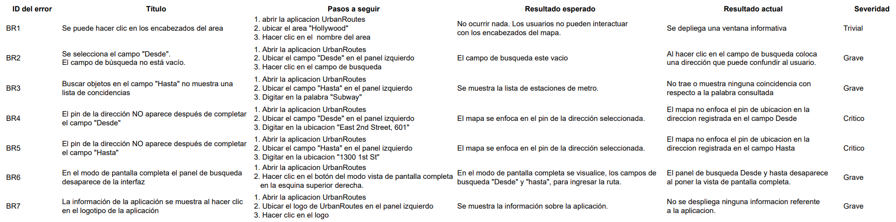

<link rel="stylesheet" type="text/css" href="styles.css">

## Acerca de mí

Profesional titulado en ingeniería de software con una reciente transición al campo del aseguramiento de calidad (QA). He adquirido competencias en análisis de requisitos, diseño y ejecución de pruebas, seguimiento de errores, pruebas de aplicaciones web y móviles.

Además, tengo conocimientos en SQL, Python, Selenium, Jira, Postman. Estas competencias me permiten realizar pruebas manuales, automatizadas y de API de manera eficiente, enfocado en crear y mantener casos de prueba detallados y alineados con las necesidades del usuario y del negocio.

---

## Proyectos

### Pruebas de regresión Urban Routers

**Descripción del Proyecto**  
En este proyecto, se realizaron pruebas de regresión de una aplicación de transporte llamada Urban Routes, Urban Routes es una aplicación que crea rutas y calcula la duración y precio del viaje para diferentes tipos de transporte.

**Objetivos**  
- Evalué los requerimientos de la aplicación según la documentación entregada.
- Cree casos de prueba basado en el requisitos analizados basado en la funcion de solicitar un vehiculo entre un punto A y un punto B.
- Ejecute los casos de prueba definiendo un estado de aprobado, no aprobado u omitido.
- Genere los informes en jira en caso de que no se aprobara un caso de prueba.

**Metodología**  
Basé mi proyecto en realizar pruebas manuales iniciando en el campo "Desde" y "Hasta" aplicando listas de comprobación que me permitieron comprobar que los campos permitian el ingreso de datos correctos, tambien que no se pudiera agregar caracteres adicionales o que no correspondieran a las especificaciones de los requerimientos.

**Conclusiones**  
- Encontré que el aplicativo aún presenta fallos en algunos de los componentes principales como por ejemplo hacer zoom, hacer clic en los encabezados, no se señala correctamente luego de colocar las coordenadas de direccion ya sea desde o hasta, todo segun lo reportado en los informe de errores.
- Observé que la plataforma apesar de los fallos de funcionamiento basico logra tener buena funcionalidad al cambio de diseño de mapa terrestre y formato 3d.
- Siendo una aplicación de primera fase o primera entrega es muy amigable e intuitiva con el usuario, con potencial a futuro.

**Lenguajes y herramientas principales**  

  
  
  
  

**Visualizaciones**

A continuación, presento detalles de los casos de prueba 

   *Lista Casos de prueba*
   

    
   

   Esta visualización muestra cómo se crearon y los pasos a seguir para efectar los distintos casos de prueba, se les da una valoración de aprobado, no aprobado u omitido

   *Informe de errores de la aplicación*
   

    
   

   Este gráfico de líneas muestra cómo las ventas de las principales plataformas de videojuegos han variado a lo largo del tiempo, permitiendo identificar las plataformas con mayor éxito en diferentes años.
 
**Explora más detalles del proyecto en el [repositorio completo](https://github.com/LeonardoLombana/Pruebas-de-regresion-Urban-Routers).**

---

### Construcción de Web App para Visualización de Datos

**Descripción del Proyecto**  
Desarrollé una aplicación web con Streamlit, diseñada para facilitar la visualización de datos de vehículos usados. La aplicación permite a los usuarios visualizar de manera interactiva distintos aspectos del conjunto de datos, proporcionando una representación gráfica sobre la distribución y las relaciones entre diferentes variables, como el precio, el odómetro y otras características relevantes de los vehículos.

**Funcionalidades**  
- **Visualización de Histogramas:** Los usuarios pueden generar histogramas para explorar la distribución de valores de cualquier variable numérica del conjunto de datos, como el kilometraje (odómetro) de los vehículos. Esto es útil para entender mejor cómo se distribuyen ciertas características dentro del mercado de vehículos usados.
- **Gráficos de Dispersión:** La aplicación también permite crear gráficos de dispersión, facilitando la exploración de las relaciones entre dos variables, como el precio y el odómetro. Esta funcionalidad es clave para identificar patrones o tendencias, como la depreciación del vehículo en relación con su kilometraje.

**Cómo Utilizar**  
Para utilizar la aplicación, simplemente seleccione la casilla de verificación correspondiente a la visualización que desea explorar. La aplicación generará automáticamente el gráfico seleccionado basándose en los datos actuales del conjunto de datos de vehículos usados.

**Lenguajes y herramientas principales**  

  
  
  

**Liga de la Web App:** [Acceder a la aplicación](https://proyecto-sprint-4-vlkw.onrender.com/)

**Explora más detalles del proyecto en el [repositorio completo](https://github.com/lorenzofdz/used-car-data-visualization).**

---

### Tableau Dashboards

A continuación, puedes ver uno de los dashboards que he desarrollado:
    

  

---

- **Envíame un correo:** [lofernandez91@gmail.com](mailto:lofernandez91@gmail.com)
- **Contáctame en LinkedIn:** [linkedin.com/in/lorenzofdz](https://www.linkedin.com/in/lorenzofdz)
- **Explora mis proyectos en GitHub:** [github.com/lorenzofdz](https://github.com/lorenzofdz)
